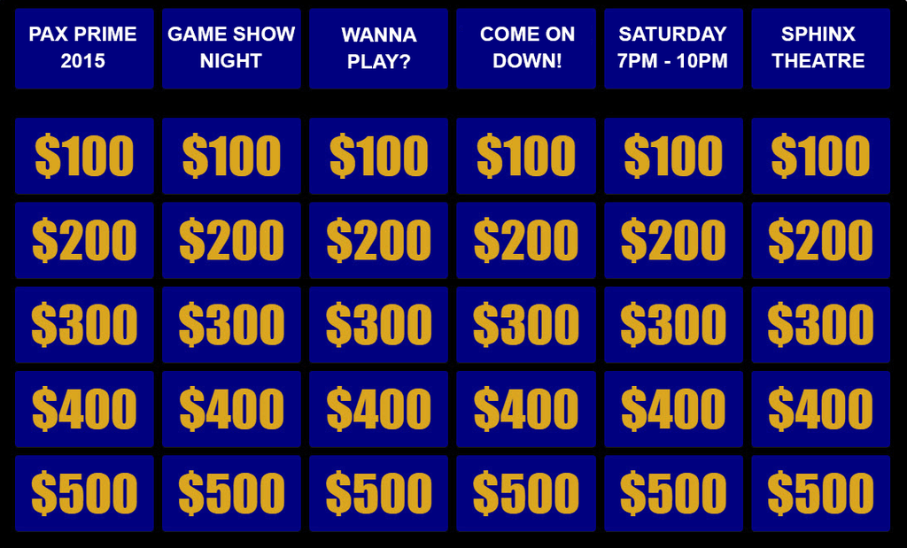

## Synopsis

A HTML5 version of Jeopardy using Javascript, JQuery, JSON, and Bootstrap. 

## Code Example

<!---->

Use board.json for sample input. Use that format when loading the game.

## Installation

Host on a website. Images should be located on the host server but referenced in the game JSON file.

## TODO

figure out where to change clue and category font and sizes

need much smaller clue hint displayed above images

no dollar signs on main board

## Contributors

Special thanks to Dan Amrich for giving the blessing to work on this project.

Thanks to Ryan McDevitt for posting a general framework to base improvements on.

## License

This software is GNU GPL v3. Feel free to contribute to the TODO projects or modify it to your needs.
